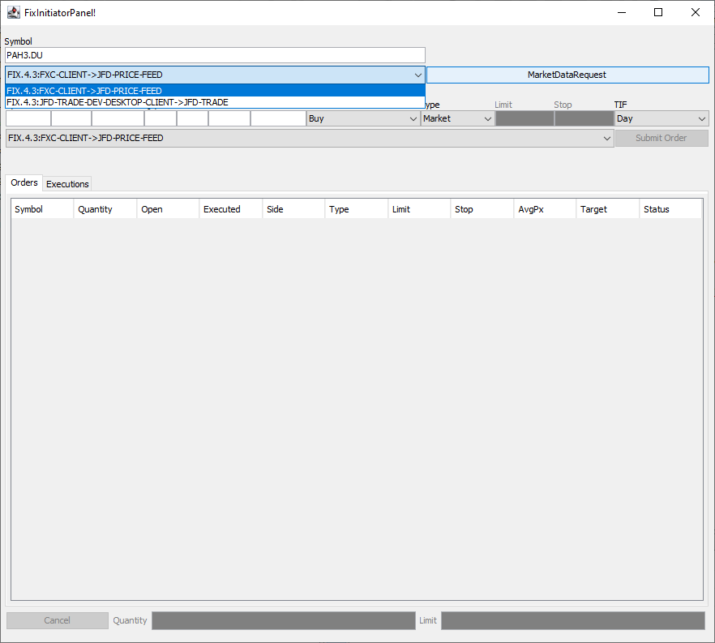
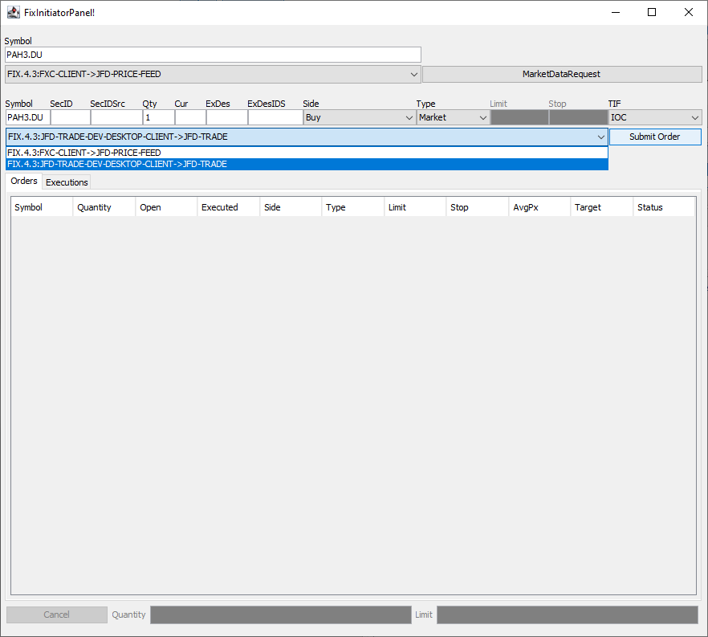
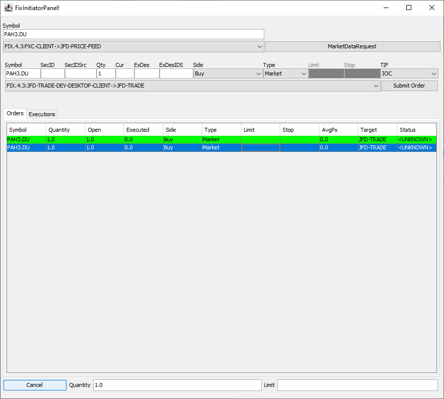

# JFD Bank FIX API Client Sample Desktop App

This Java project is a sample desktop application which is a client for the JFD Bank FIX API

## Features

1. **[QuickFixJ](https://www.quickfixj.org/)** 2.3.0 is the underlying FIX Engine.
2. Auto connecting and logon to JFD Bank FIX API. 
3. MarketDataRequest for getting price feed data from the market through JFD Bank FIX API
4. Order creation for buy or sell of financial instruments through JFD Bank FIX API
5. Cancellation of Orders through JFD Bank FIX API

## Dependencies

1. This Java project is developed by Apache NetBeans IDE 12.4
2. JDK 11+
3. MySQL 8+ or MSSQL Server for local FIX message logging

## Project Folder Structure

* **./config**: This folder contains the FIX engine configuration file.
`fix.initiator.client.JFDBankFIXAPI.staging.cfg` is the configuration file that you need to adjust based on client information.
The client session information will be provided by JFD Bank team for your development and tests.
You will need these information in the configuration file
* **./lib**: Contains the libraries used in this project. Such as QuickFIX engine **.jar** files.
* **./mssql**: Contains the SQL scripts if you want the FIX messaging is persisted into MS SQL Server Database.
* **./mysql**: Contains the SQL scripts if you want the FIX messaging is persisted into MySQL Database.
* **./npproject**: This is the NetBeans project definition
* **./src**: Source codes

## Configuration of the File

1. Configure the FIX message persistance. 
Set `PersistMessages=N` if you do not want to persist messages and logs into your local database.
If you want ot persist on database, then `PersistMessages=Y` as shown example below:
```
PersistMessages=Y
JdbcDriver=com.mysql.jdbc.Driver
JdbcURL=jdbc:mysql://localhost:3306/fixapisampledb
JdbcUser=your_local_db_user_name
JdbcPassword=your_local_db_user_password
JdbcLogHeartBeats=N
JdbcStoreMessagesTableName=quickfix_initiator_messages
JdbcStoreSessionsTableName=quickfix_initiator_sessions
JdbcLogIncomingTable=quickfix_initiator_messages_log_incoming
JdbcLogOutgoingTable=quickfix_initiator_messages_log_outgoing
JdbcLogEventTable=quickfix_initiator_events_log
```

2. Configure your client session info in order to use JFD Bank Price Feed FIX API
```
# Price Feed FIX API Session
[SESSION]
BeginString=FIX.4.3
SocketConnectHost=fixapi-test.reaven.tech
SocketConnectPort=25252
# This is id of our client at acceptor side and should be SenderCompID at initiator party. 
SenderCompID=JFD-PRICE-FEED-DEV-DESKTOP-CLIENT
# This is our id at acceptor side and should be TargetCompID at initiator party
TargetCompID=JFD-PRICE-FEED
# SSL config
SocketUseSSL=Y
EnabledProtocols=TLSv1.2
```

3. Configure your client session info in order to use JFD Bank Trader OMS FIX API
```
# Trader OMS FIX API Session
[SESSION]
BeginString=FIX.4.3
SenderCompID=JFD-TRADE-DEV-DESKTOP-CLIENT
TargetCompID=JFD-TRADE
SocketConnectHost=fixapi-test.reaven.tech
SocketConnectPort=25260
# SSL config
SocketUseSSL=Y
EnabledProtocols=TLSv1.2
```

4. Run the database scripts under one of the directories based on your database (MySQL or MS SQL Server)
* **./mssql**: Contains the SQL scripts if you want the FIX messaging is persisted into MS SQL Server Database.
* **./mysql**: Contains the SQL scripts if you want the FIX messaging is persisted into MySQL Database.

5. Set your user name and password for the FIX session client provided to you in the code.
`InitiatorDemoDesktopApplication.toAdmin()` function.

```java
if(MsgType.LOGON.compareTo(msgType) == 0 && FixVersions.BEGINSTRING_FIX43.compareTo(msgBeginString) == 0)
{
    // for JFD TRADE FIX
    if (senderCompIDString.equals("JFD-TRADE-DEV-DESKTOP-CLIENT")) {
        message.setString(quickfix.field.Username.FIELD, "your_username");
        message.setString(quickfix.field.Password.FIELD, "your_password");
    }
    // for JFD PRICE FEED FIX
    else if (senderCompIDString.equals("JFD-PRICE-FEED-DEV-DESKTOP-CLIENT")) {
        message.setString(quickfix.field.Username.FIELD, "your_username");
        message.setString(quickfix.field.Password.FIELD, "your_password");
    }            

    // 141 ResetSeqNumFlag N Set to ‘Y’ to Indicate both sides of a FIX session should reset sequence numbers. Must be ‘Y’ on pricing session
    ResetSeqNumFlag resetSeqNumFlag = new ResetSeqNumFlag(true);
    message.setField(resetSeqNumFlag);
}
```

## Usage of App

1. Market Data Request:


2. Send new order request:


3. Send order cancel request for the selected order:



